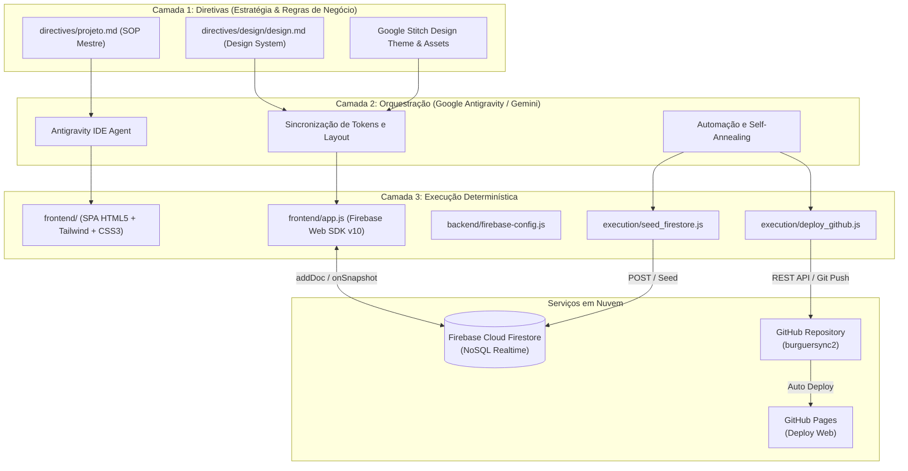
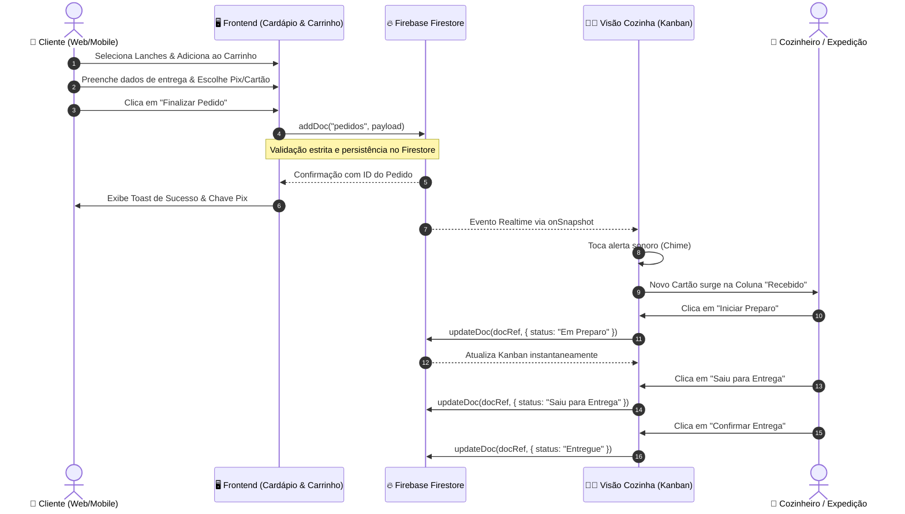

# 🏛️ Arquitetura do Sistema: BurguerSync Ourinhos

Documento técnico descritivo da arquitetura em 3 Camadas do sistema BurguerSync Ourinhos, detalhando fluxos de dados, componentes e integração com Firebase Cloud Firestore e Google Stitch.

---

## 1. Visão Geral das Camadas



---

## 2. Fluxo Bidirecional de Pedidos em Tempo Real



---

## 3. Esquema de Dados (Firestore NoSQL)

Coleção: `pedidos`

```json
{
  "numeroPedido": 1043,
  "cliente": {
    "nome": "Mariana Santos",
    "email": "mariana.santos@email.com",
    "celular": "(14) 99123-8899",
    "endereco": "Rua São Paulo, 720 - Vila Brasil, Ourinhos - SP",
    "obsEntrega": "Interfone 12"
  },
  "itens": [
    {
      "nome": "Monster Bacon SENAI",
      "preco": 34.00,
      "quantidade": 2,
      "obsItem": "Ponto da carne ao ponto para mal passado"
    }
  ],
  "pagamento": {
    "metodo": "Pix",
    "troco": ""
  },
  "valores": {
    "subtotal": 68.00,
    "taxaEntrega": 5.00,
    "total": 73.00
  },
  "status": "Recebido",
  "obsCozinha": "Ponto da carne ao ponto para mal passado. Molho extra se possível.",
  "criadoEm": "2026-09-26T14:50:00.000Z",
  "horario": "serverTimestamp()"
}
```
